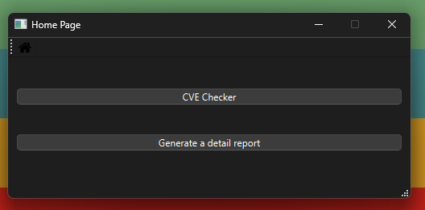
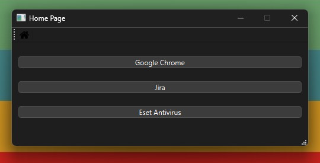
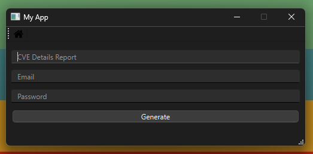
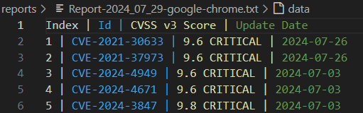

# CVE-Checker Terminal Version (For Dev Only !!! )
Simple Latest CVE Checker Written in Python

![made-with-python][made-with-python]
![Python Versions][pyversion-button]
[pyversion-button]: https://img.shields.io/pypi/pyversions/Markdown.svg
[made-with-python]: https://img.shields.io/badge/Made%20with-Python-1f425f.svg

This checker uses a search query on https://www.opencve.io

## Features :
Allows you to check the latests cve of a technology. For the moment you can check for :
- Google Chrome
- Jira
- Eset Antivirus

Once it's done, you can generate a report in "reports" folder :
--> Report-actual_date-technology.txt

It also allow you to generate a details report of an specific CVE. But for that features, you will need an account on opencve.
Once it's done : 

## Preview :
### Application :
#### Home page :

#### Cve Checker :

#### Details Report Generator :

### Report :

## Futur Features :
- Check for Cisco Meraki
- Managed error to create logs file
